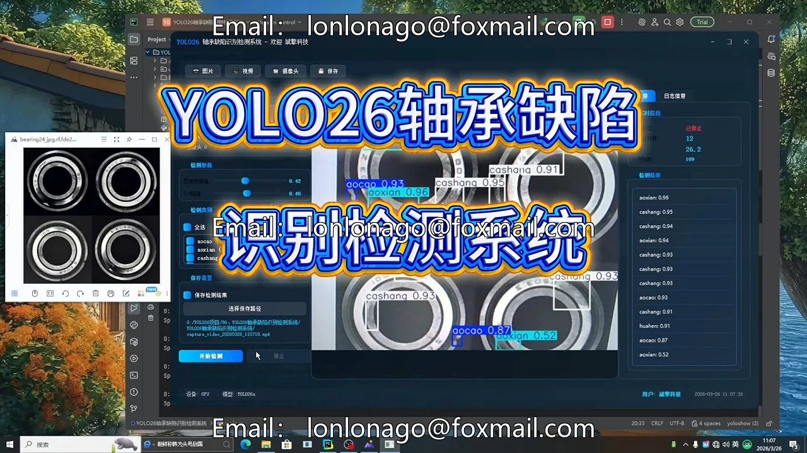
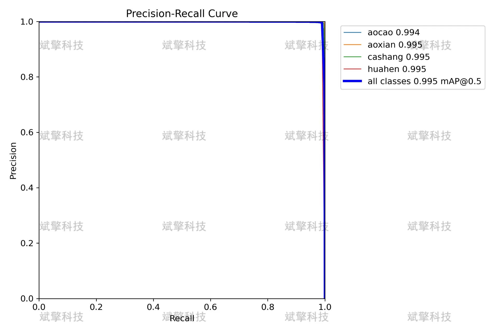
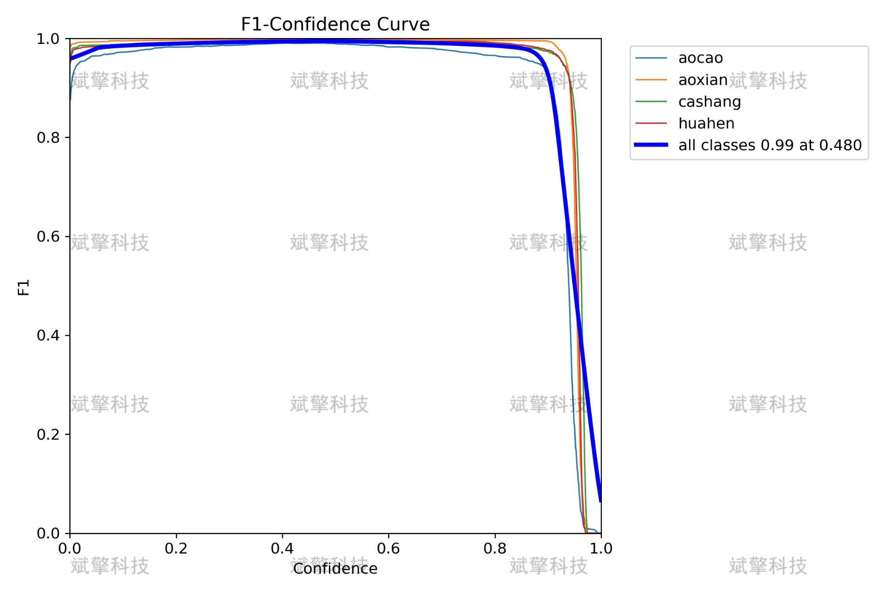
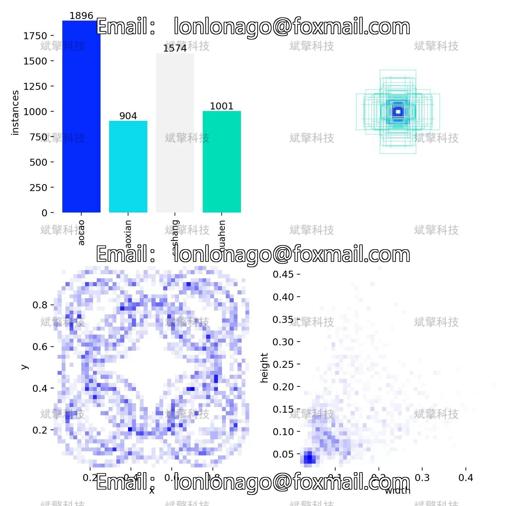
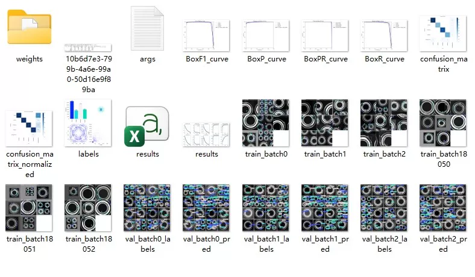
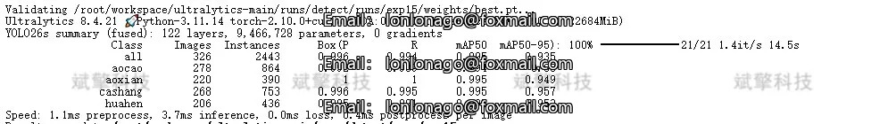
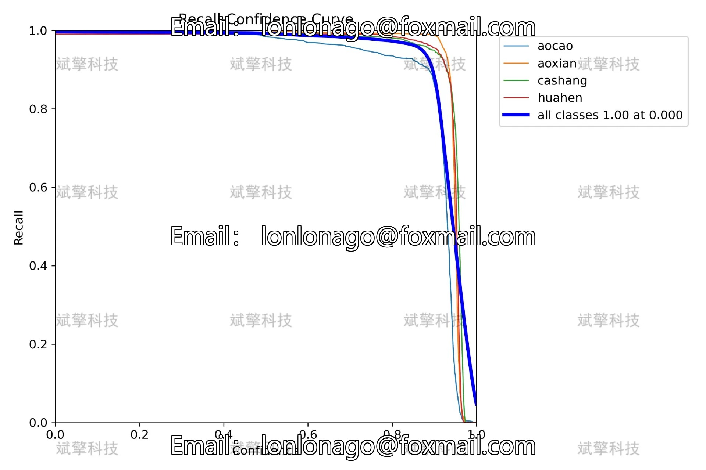
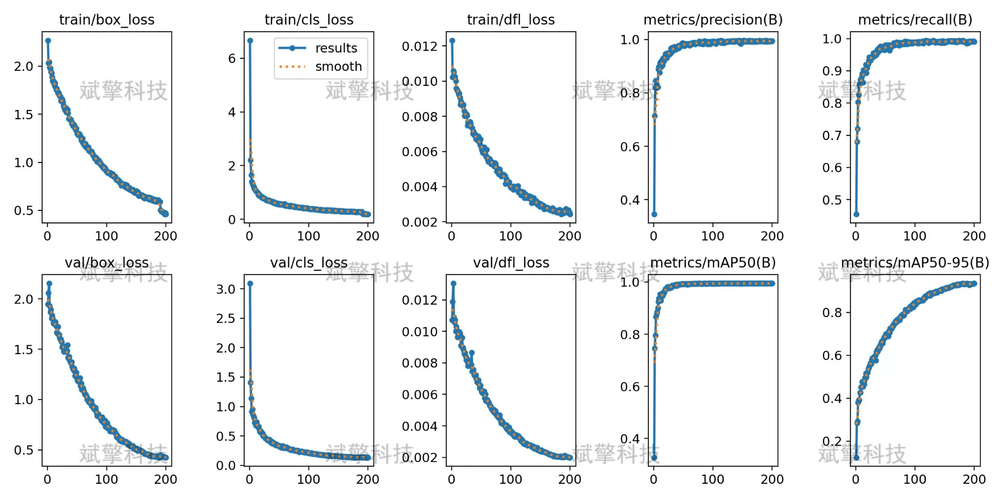
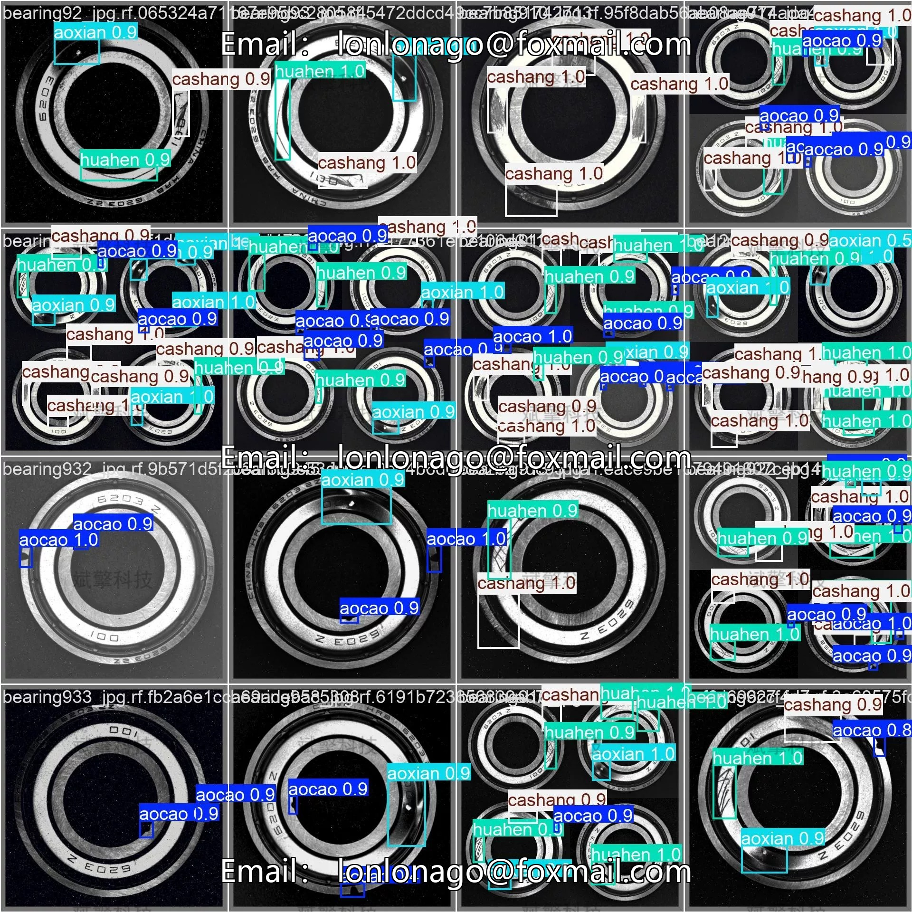

# YOLO26 bearing defect detection system | source code + model

## Body

YOLO26 Bearing Defect Detection System | Source Code + Model Tutorial to Train Bearing Defect Detection with YOLO26 (Project Source Code + Dataset + Model Weights + UI Interface + Python + Deep Learning + Remote Environment Deployment)

As the core components of mechanical equipment, the automatic detection of surface defects on bearings is of great significance for ensuring the safe operation of these devices. This study builds an intelligent recognition and detection system for four typical defects on bearing surfaces based on the YOLO26 object detection algorithm. The system employs an improved YOLO26 network architecture and is trained and validated on a self-constructed dataset containing 1085 labeled images. The experimental results show that the model achieves an mAP50 of 0.995 and an mAP50-95 of 0.935 on the validation set, with an accuracy rate of 0.996 and a recall rate of 0.994. Among these, the recognition accuracy for three types of defects (aoxian, cashang, huahen) exceeds 0.995, while the mAP50 for the aocao defect is 0.994. The model's inference speed reaches 3.7ms per image, meeting the requirements of real-time industrial detection. This study provides an efficient and accurate solution for the automated detection of bearing surface defects.

Based on the quality inspection standards of bearing industry and the actual needs in production site, this study defines four types of surface defects:
aocao (pit): A local depression area appearing on the bearing surface, usually caused by abnormal pressure during grinding process or wheel vibration. The edges of pit are relatively smooth, with a shallow depth but a relatively large area, which significantly affects the rotation accuracy of the bearing.
aoxian (oxidation line): A phenomenon of surface oxidation and discoloration due to local overheating during heat treatment or grinding process, presenting as thin and long strip-like lines. Oxidation lines not only affect appearance but also indicate that the material properties of the affected area may have changed, making it a focus of quality control.
cashang (abrasion): A damage caused by friction between the bearing surface and other objects, manifesting as irregular wear areas. Abrasion often accompanied by plastic deformation of the material surface, and in severe cases, it can change the geometric dimensions of the bearing.
huahen (scratch): A linear trace left by a sharp object passing over the bearing surface, varying in depth and direction randomly. Scratches can destroy the integrity of the surface and may expand into cracks under stress.

Free remote installation appointments. Unsuccessful, full refund.
Purchase includes the following resources (auto-unlocked by Baidu Pan)
YOLO recognition detection project complete source code
YOLO format dataset
Training code + UI interface code
Trained model + result images
Software installer
Add WeChat to make a remote installation appointment (shown automatically after purchase) —— Unsuccessful, full refund

⚙️ Core Function Modules
Detection Capabilities
    Image Detection: Upon upload, returns detection boxes + category information.
    Video Detection: Supports video files, analyzes frames accurately in real-time.
    Camera Real-Time Detection: Attaches USB cameras to achieve dynamic monitoring.

️ Interaction and Control
    Target Filtering: Choose one or more categories for detection freely.
    Parameter Real-Time Adjustment: Adjustable confidence threshold & IoU threshold, flexibly control accuracy.
    Result Save: One-click save of image/video/camera detection results.

System and Data
    User Login and Registration: Supports password strength checking + encrypted storage.
    Logging: Automated recording of operation and error information (timestamped).

## Images

## Payment

Here is a pay link on Stripe ( https://buy.stripe.com/3cs8yP7sY87d0vu9AB ). Please contact me lonlonago@foxmail.com after funding $89, and I will send you a complete data files , thank you!

